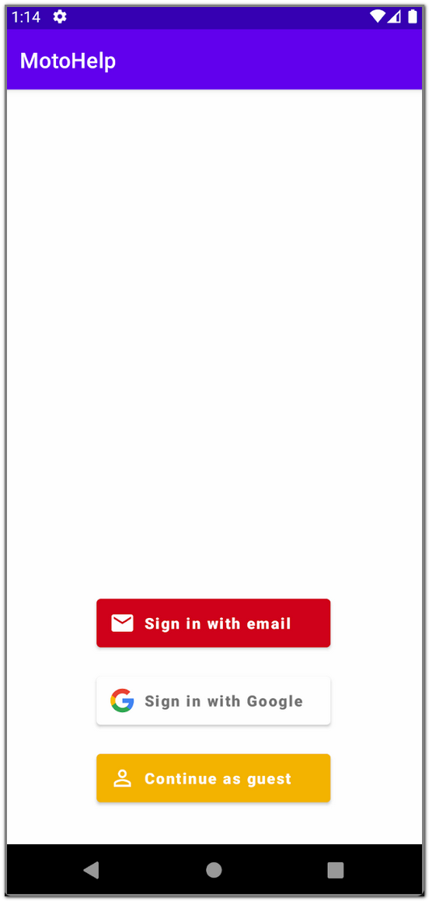
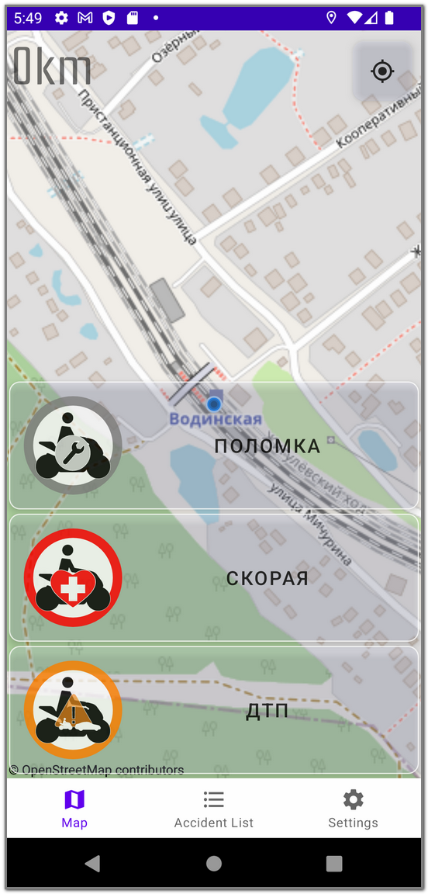
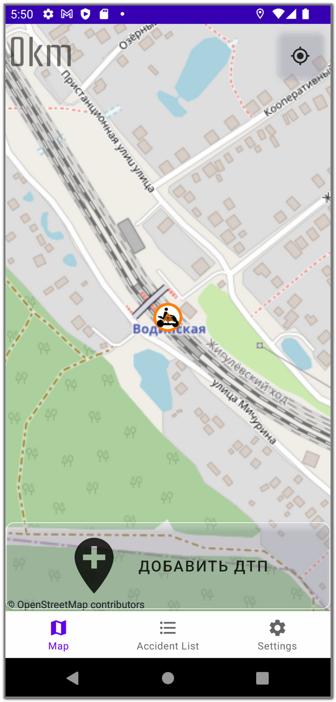
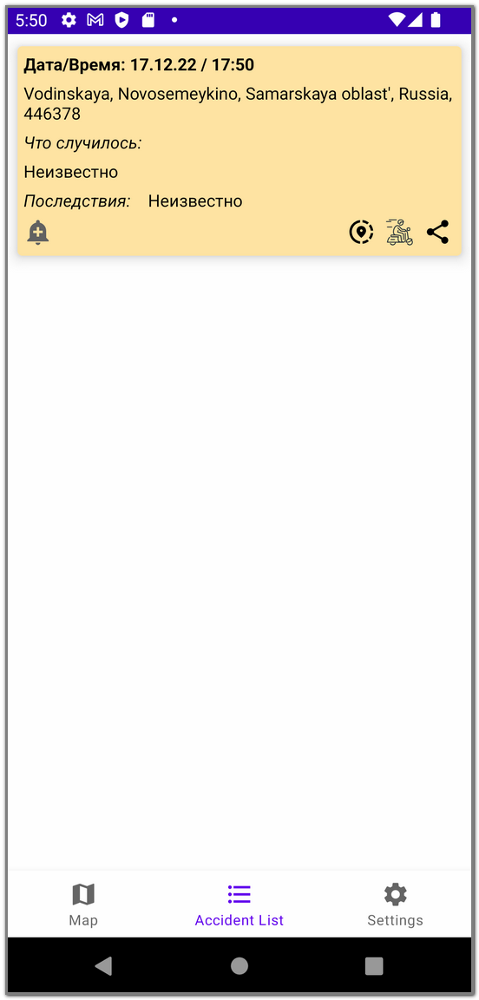
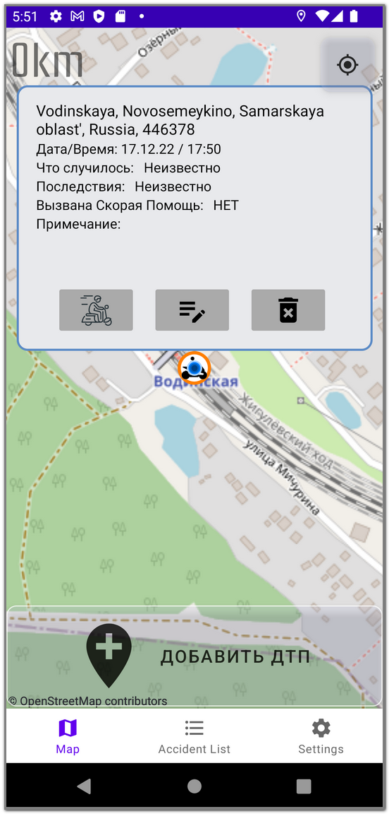
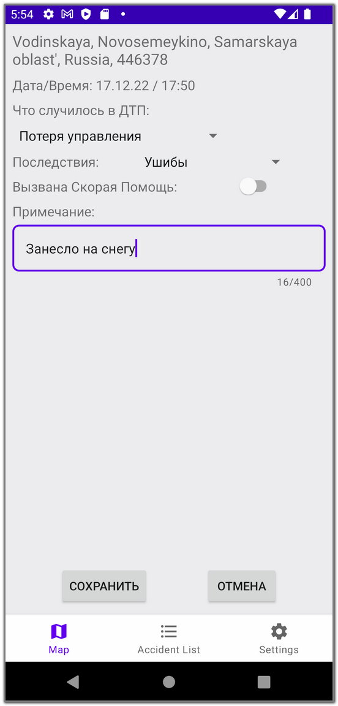
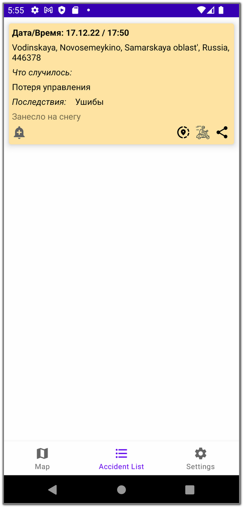
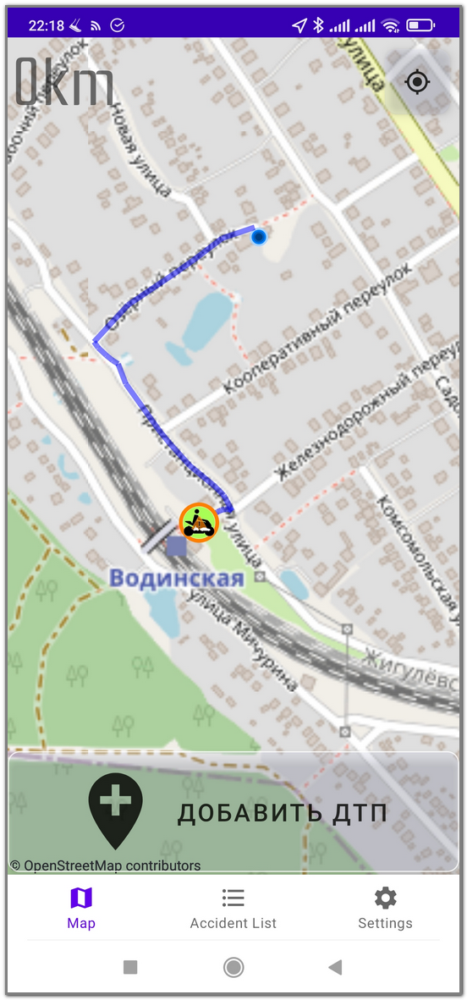
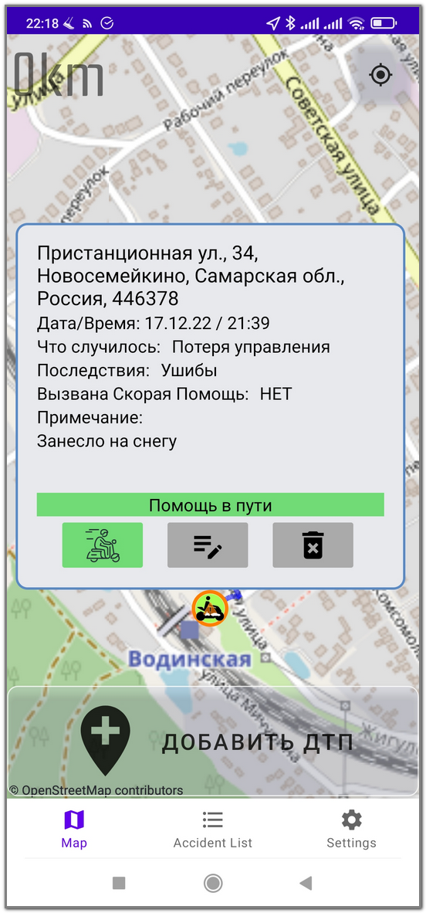

# Проект “Помощь на дорогах”

## Оглавление

- [Цели создание приложения](#цели-создания-приложения)
    
- [Функционал](#функционал)
    
- [Основная аудитория](#основная-аудитория)

- [Уточнения по основным пользователям и права доступа к функционалу](#уточнения-по-основным-пользователям-и-права-доступа-к-функционалу)
    - [Гость](#гость)
    - [Пользователь (райдер)](#пользователь-райдер)
    - [Комиссар](#комиссар)
    - [Данные, отражаемые в маркере](#данные-отражаемые-в-маркере)
    
- [Используемые библиотеки](#используемые-библиотеки)
- [Скриншоты приложения](#скриншоты-приложения)
- [Дополнительная информация](#дополнительная-информация)

## Цели создания приложения.

Цель приложения дать возможность удобно управлять и отслеживать собственный маршрут водителю двухколесного транспортного средства в режиме езды.

Как известно на дорогах общего пользования очень часто велосипедисты, водители скутеров/мотоциклов по своей вине либо по вине других участников движения попадают мелкие либо крупные ДТП. В крупных городах России многие мотоциклисты объединяются в социальных сетях и мессенджерах для общения и оперативной помощи пострадавшему водителю. В качестве примера в Москве есть такие группы как:

-   МотоМосква ДТП: [https://vk.com/motomsk_dtp](https://vk.com/motomsk_dtp)
    
-   Motocitizen ДТП: [https://t.me/+TC6SWHy6w4zRdUsz](https://t.me/+TC6SWHy6w4zRdUsz)
    
-   ММ.Дтп 8-800-775-17-34: [https://t.me/+gvL2EqJf13A1ZjRi](https://t.me/+gvL2EqJf13A1ZjRi) и другие.
    

Находясь за рулем мотоцикла, в потоке ТС, увидев ДТП, райдеру очень опасно на ходу в подобный чат набирать сообщение. В результате мотоциклист перестраивается, ищет место, где можно остановиться и спокойно набрать сообщение в общий чат о ДТП.

Данное приложение призвано без труда поставить метку о ДТП и его тяжесть одной рукой в пару касаний.

## Функционал.

Функционал (основной):

1.  отображение карты города
    
2.  установка меток ДТП (три цвета, по ощущениям проезжающего мимо райдера)
    
3.  указать о необходимости вызова СМП (автомобиля Скорой Медицинской Помощи)
    
4.  установка метки поломки мотоцикла
    
5.  функция вызова SOS (для пользователей приложения + отправка смс уведомление определенному контакту с координатами ДТП)
    
6.  Кнопка экстренного вызова. Номер экстренного вызова - по умолчанию общий телефон помощи или ставиться телефон близкого человека.
    
7.  отображение текущей погоды в месте нахождения + небольшой прогноз на 2-3 дня (в планах)
    
8.  построение маршрута из точки А в точку Б

Данный функционал должен быть удобным для управления левой рукой райдера.

В режиме “гость” отключена возможность ставить метки.

После общения с целевой аудиторией (мотоциклистов) реализован следующий функционал - ручная установка метки (когда райдер остановился, нажал разместить метку и смог выбрать следующие опции не спеша):

1.  тяжесть ДТП: ушибы/переломы/критическое состояние - связан с п.2 основного функционала.
    
2.  требуется ли эвакуатор
    
3.  нужна ли помощь в оформлении
    
4.  возможность загрузить фото происшествия (в планах)
    
5.  наличие экипировки у райдера/пассажира (в планах)
    
6.  тип ДТП: столкновение с авто/наезд на пешехода/столкновение с райдером/потеря управления

**Ограничения**

1.  Метки умеют протухать. Происшествия даже часовой давности не актуальны
    
2.  Необходимо продумать механизм дедупликации. Несколько меток на одно происшествие создадут визуальный шум (в планах)
    
3.  Есть механизм удаления (принудительного протухания) меток.
    
4.  Время реакции пилота, допустим 1 секунда, дотянуться до экрана, выбрать нужный пункт - допустим ещё 3 секунды. На 80 км/ч - это почти 100 метров. Можно проработать механизм, рассчитывающий реальное положение ДТП с учётом текущей скорости мотоцикла (в планах)
    
5.  Необходимы рейтлимиты и механизм банов от спамеров (в планах)

## Основная аудитория.

Основной аудиторией данного проекта являются мотоциклисты. При успехе приложения, можно добавить функционал и для любителей самокатов, квадроциклов и прочей техники.

**Юзкейсы**  
1) Создание события на ходу, когда нет возможности остановиться. Минимальный, но достаточный UI для очень быстрого создания события с минимальным отвлечением от управления ТС  
2) Создание события после остановки. Расширенный функционал, позволяющий указать больше деталей.  
3) Отслеживание происшествий по маршруту следования. Возможность быстро перестроить маршрут до точки ДТП.

4) Кнопка SOS, звонок другу и т.д.  
  
Все пункты, кроме третьего, про инициацию события. Третий пункт про реакцию на событие. Но он выглядит как очень частный случай.  
 

## Уточнения по основным пользователям и права доступа к функционалу.
  

### Гость
- Без регистрации.
- Можно увидеть свое местоположение на карте.
- Можно увидеть маркеры ДТП на карте.
- Нажатие на маркер ДТП увидит данные “быстрого” и “медленного” маркера.
 

### Пользователь (райдер)

- Обязательная регистрация.
- Можно увидеть свое местоположение на карте.
- Можно увидеть маркеры ДТП на карте.
- Возможность поставить “быстрый” и “медленный” маркер ДТП.
- Возможность погасить свой маркер ДТП.
- Нажатие на маркер любого ДТП увидит данные “быстрого” и “медленного” маркера.

### Комиссар

- Обязательная регистрация.
- Можно увидеть свое местоположение на карте.
- Можно увидеть маркеры ДТП на карте.
- Возможность поставить “быстрый” и “медленный” маркер ДТП.
- Возможность погасить свой маркер ДТП и чужой, даже если он не протух (модерация).
- Можно увидеть весь свежий (“не протухший”) список ДТП. Зайти на каждое ДТП, с возможностью увидеть внесенную информацию и добавить свою информацию.
- Может обращаться к БД ДТП за любой период учета и работать с перечнем ДТП как со свежим списком.

### Данные, отражаемые в маркере.

- “Быстрый” маркер:
    - Три вида маркера - поломка (серый), авария (рыжий), тяжелая авария с необходимостью скорой помощи (красный).
    - Дата/Время события.
    - Координаты события
    - Полный адрес (какой можно выдернуть из геокодирования)
    - Статус маркера:
        - маркер поставлен (Base)
        - к ДТП выехали (Checked)
        - маркер не актуален (NotRelevant)
    
- “Медленный” маркер:
    - Тип ДТП:
        - столкновение с авто
        - наезд на пешехода
        - столкновение с райдером
        - потеря управления.
        - прочее
    - Тяжесть ДТП:
        - без травм
        - ушибы
        - переломы
        - критическое состояние
        - есть жертвы
        - неизвестно
    - СМП вызвано - Да/Нет.

- Дополнение к блоку ДТП (в планах):

    - Наличие экипировки у райдера -Да/Нет
    - Наличие экипировки у пассажира - Да/Нет
    - Нужна ли помощь в оформлении - Да/Нет

Общее (под всеми блоками) текстовое описание (не более 400 символов)

## Используемые библиотеки.

для карт - osmdroid ([https://github.com/osmdroid/osmdroid](https://github.com/osmdroid/osmdroid)), без привязки к Гугл или Яндекс картам

для погоды - OpenWeather  [https://openweathermap.org/](https://openweathermap.org/) (есть бесплатное API)

## Скриншоты приложения.
### Вход в приложение

### Основной экран  

### Установка маркера

### Маркер ДТП установлен

### Маркер ДТП в списке маркеров

### Маркер ДТП на карте

### Уточнение информации о ДТП

### Уточненный маркер ДТП в списке

### Маршрут к месту ДТП

### Индикация, что помощь в пути

## Дополнительная информация
Для просмотра и редактирования схемы работы приложения и макета используем  [https://app.diagrams.net](https://app.diagrams.net/), открыть с Github по следующим ссылкам:

[Схема работы приложения](./scheme_v1.drawio)

[Макет приложения](./maket.drawio)

Документация по проекту:  [https://docs.google.com/document/d/1ibJW3-lc5dMOJIEu5XrHqnL5S3fu-afudGxyldtIvbs/](https://docs.google.com/document/d/1ibJW3-lc5dMOJIEu5XrHqnL5S3fu-afudGxyldtIvbs/)

[Схема взаимодействия модулей проекта](./scheme_v1.pdf)  - v.1

[Макет приложения](./maket.pdf)  - v.1
